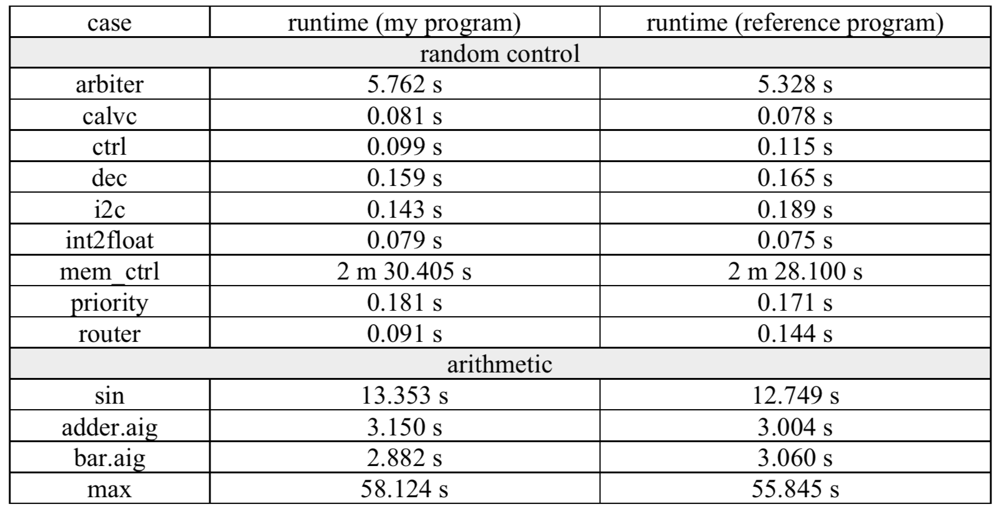

## 2020 Fall Logic Synthesis and Verification - Programming Assignment 2

### Implementation
#### Used API
 * I used `Abc_NtkCreateCone` to extract a single PO's circuit. The parameter `fUseAllCis` is set to 0 to exclude the irrelevant PIs.
 * I used `Abc_NtkToDar` to convert the extracted cone into `Aig_Man_t *` .
 * I used `Cnf_Derive` to generate the clauses of "positive cofactor circuit" and `Cnf_DataWriteIntoSolver` to create a new SAT solver with these clauses. I used `Cnf_DataLift` to rename the variables so as to represent the clauses of "negative cofactor circuit" and use `sat_solver_addclause` to append these new clauses.
 * I used `sat_solver_addvar` to generate the variables that enables or disables pairwise PI-equivalence between the positive cofactor circuit and negative cofactor circuit.
 * I used `sat_solver_solve` to do incremental SAT solving. All conflict limit parameters are set to 0.
 
#### Data Structure 
  * `vector<int> UnateVec`: I used a vector<int> of length = number of PIs in circuit to reprensent the unateness with respect to every Pi. There are four cases. I used 0 to represent both positive and negative unate, 1 to represent positvie unate, 2 to represent negative unate, and 3 to represent binate. Initially, every entry is set to 3. If i-th PI is positive unate after SAT solving, I do `UnateVec[i] &= 1`. Similary, if it is negative unate, I do `UnateVec[i] &= 2`. Therefore, if i-th PI is both positive and negative unate, `UnateVec[i] = 0` eventually. Similary, if some PI is neither positive unate nor negative unate, it remains 3.
 
  * `vector<int> posCofPiVars`: I used a vector<int> of length = number of PIs to bookeep the variable number of PIs in the positive cofactor circuit in CNF. Since Both `Abc_NtkCreateCone` and `Abc_NtkToDar` creates PI by the order of `Abc_NtkForEachPi`, the order of PI is not changed. Therefore, instead of constructing a mapping of PI between the original circuit and the PO cone, I only do a linear search a use `Abc_ObjName` to pair each PI. That is, `posCofPiVars[i] = var of i-th PI in original circuit` and `posCofPiVars[i] = NOTUSED` flag if the PI is not in the cone of current PO. I didn't keep track of the variable number of PIs in the negative cofactor. I only record an integer `VarShift` between the positive and negative cofactor circuit. 
 
  * `vector<int> ForceEqVars`: I used a vector<int> of length = number of PIs to bookeep the number of the variables that enables or disables PI-equivalence.
  * `lit * assumpList`: I used an array to store the assumption literals that will be pushed into SAT solver. 
 
#### Issues
 * I've tried to generate CNF from the entire circuit (without extracting a cone) initially, but in this way, `mem_ctrl.aig` and `sin.aig` can not be solved within 300s. Therefore, I tried  `Abc_NtkCreateCone` with `fUseAllCis = 1`, this parameter will preserve all PIs. However, `mem_ctrl.aig` and `sin.aig` are still unsolvable within the time limit. Eventually, `Abc_NtkCreateCone` with `fUseAllCis = 0` works well. I observed that in `mem_ctrl.aig`, some cone will result in single PI, which greatly reduce the redundant SAT solving on irrelevant PI.
 
 ### Experimental Results

We can see that arithmetic cases take more time on average. I think the reason to this is arithmetic cases have more XOR operations with respect to PIs. Moreover, in arithmetic cases, MSB generally depends on larger cones with more PIs.
